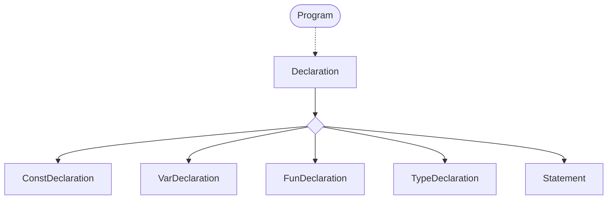
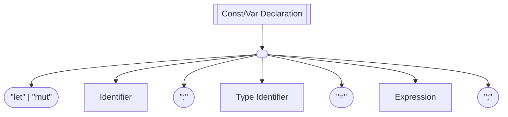
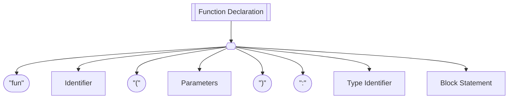
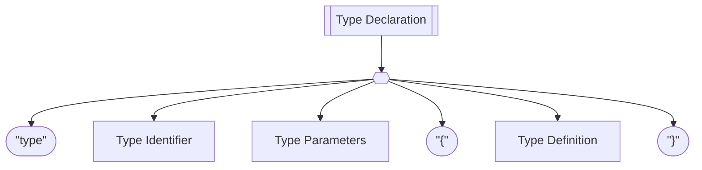

# Grammar
This is the grammar of Yoloscript. It is still very much a work in progress, so it may change in the future.

## EBNF

Program              ::= { Declaration } EOF ;

Declaration          ::= ConstDeclaration
                       | VarDeclaration    
                       | FunDeclaration
                       | Statement ;

ConstDeclaration     ::= "let" IDENTIFIER  [ "=" Expression ] ";" ;

VarDeclaration       ::= "mut" IDENTIFIER [ "=" Expression ] ";" ;

FunDeclaration       ::= "fun" IDENTIFIER "(" [ Parameters ] ")" BlockStatement ;

Parameters           ::= IDENTIFIER { "," IDENTIFIER } ;

Statement            ::= ExpressionStatement
                       | PrintStatement
                       | WhileStatement
                       | IfStatement
                       | ForStatement
                       | ReturnStatement
                       | BlockStatement ;

WhileStatement       ::= "while" "(" Expression ")" Statement ;

ForStatement         ::= "for" "(" [ Expression ] ";" [ Expression ] ";" [ Expression ] ")" Statement ;

IfStatement          ::= "if" "(" Expression ")" Statement
                         [ "else" Statement ] ;

BlockStatement       ::= "{" { Declaration } "}" ;

ExpressionStatement  ::= Expression ";" ;

ReturnStatement      ::= "return" [ Expression ] ";" ;

PrintStatement       ::= "print" Expression ";" ;

Expression           ::= AssignmentExpression ;

AssignmentExpression ::= Assignment
                       | LogicalOrExpression ;

Assignment           ::= IDENTIFIER "=" Expression ;

LogicalOrExpression  ::= LogicalAndExpression
                       { "||" LogicalAndExpression } ;

LogicalAndExpression ::= ComparisonExpression
                       { "&&" ComparisonExpression } ;

ComparisonExpression ::= AdditionExpression
                       { ( ">" | ">=" | "<" | "<=" | "!=" | "==" )
                         AdditionExpression } ;

AdditionExpression   ::= MultiplicationExpression
                       { ( "+" | "-" ) MultiplicationExpression } ;

MultiplicationExpression
                     ::= UnaryExpression
                       { ( "*" | "/" ) UnaryExpression } ;

UnaryExpression      ::= ( "!" | "-" ) UnaryExpression
                       | CallExpression ;

CallExpression       ::= PrimaryExpression
                       { "(" [ Arguments ] ")" } ;

Arguments            ::= Expression { "," Expression } ;

PrimaryExpression    ::= NUMBER
                       | STRING
                       | "true"
                       | "false"
                       | "nil"
                       | "(" Expression ")"
                       | IDENTIFIER ;

## Graph

### Program

### Const/Var Declaration

### Function Declaration

### Type Declaration

